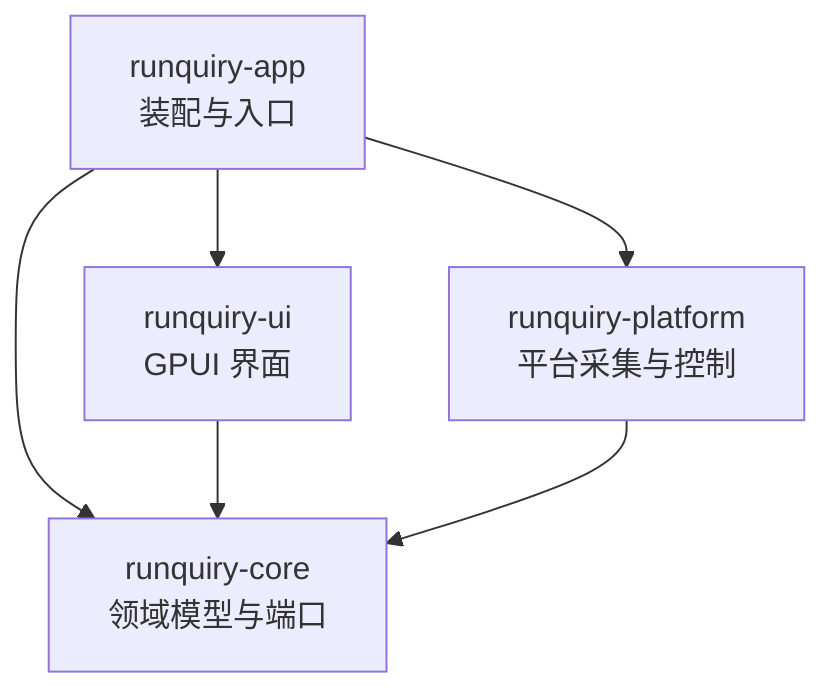

# Runquiry

对本地 [witr](witr/README.md)（Go CLI/TUI）的纯 Rust + GPUI 桌面化重写：原生桌面 GUI，提供 Processes、Ports、Containers、File Locks 四个工作区与按名称、PID、端口、文件、容器发起的调查。不嵌入 Go，不新增 CLI/TUI；运行期完全本地（无遥测、云服务、自动更新或后台网络请求）。目标平台 Linux 与 Windows，交付无签名安装包。

## 架构总览

Cargo workspace（resolver = "3"），四层单向依赖：



- **runquiry-core**：领域模型、目标解析、分析管线、告警规则、刷新状态机、平台端口（trait）。不依赖 GPUI 或操作系统。
- **runquiry-platform**：core 端口的 Linux/Windows 双平台实现（采集器、容器运行时、进程控制、外部命令执行）。
- **runquiry-ui**：GPUI 状态、设计系统、四个工作区、调查面板、设置与国际化。
- **runquiry-app**：可执行装配层（窗口启动、配置持久化、资源与打包元数据）。

参考代码 [witr/](witr/README.md) 是行为契约的静态阅读来源，**不参与构建、不得修改、不入 Git**。

## 模块索引

| 模块 | 职责 | 文档 |
|---|---|---|
| crates/runquiry-core | 领域模型、目标解析、管线与平台端口 | [AGENTS.md](crates/runquiry-core/AGENTS.md) |
| crates/runquiry-platform | 平台采集器、容器运行时与进程控制 | [AGENTS.md](crates/runquiry-platform/AGENTS.md) |
| crates/runquiry-ui | GPUI 界面：工作区、调查面板与设计系统 | [AGENTS.md](crates/runquiry-ui/AGENTS.md) |
| crates/runquiry-app | 依赖装配、窗口启动与打包元数据 | [AGENTS.md](crates/runquiry-app/AGENTS.md) |
| docs/witr-parity.md | witr 行为契约（202 条，Runquiry 语义的唯一来源） | [witr-parity.md](docs/witr-parity.md) |
| .omo/plans/runquiry-gpui-desktop/ | 7 个模块的实施计划与任务勾选 | [总计划](.omo/plans/runquiry-gpui-desktop.md) |

## 运行与开发

```bash
cargo check -p runquiry-app --locked   # 编译检查（必须 --locked）
cargo run -p runquiry-app --locked     # 启动产品壳层与本地采集后端
cargo fmt --check                      # 格式检查
cargo deny check                       # 许可证/ advisories / 来源检查（需 cargo-deny）
```

- 工具链由 [rust-toolchain.toml](rust-toolchain.toml) 锁定 1.95.0（1.90–1.94 均实测编译失败，证据见模块 01 计划）。
- Linux 构建需系统依赖：pkg-config、libfontconfig1-dev、libfreetype-dev、libxkbcommon-dev、libxkbcommon-x11-dev、libwayland-dev、wayland-protocols、libx11-dev。
- WSLg 下 libEGL/MESA 软件渲染警告属正常。

## 依赖锁定（关键约束）

- GPUI Kit 在根 `Cargo.toml` 的 workspace dependencies 中精确锁定为 `=0.6.1`，runquiry-app 与 runquiry-ui 统一继承；GPUI、组件与资源分别由 `gpui_kit`、`gpui_kit::component`、`gpui_kit::assets` 提供。
- 配套 `gpui-pre-*` 由 `Cargo.lock` 锁定为 0.3.4，依赖来源统一为 crates.io；不得混入旧 GPUI/git 组件依赖。
- **禁止无差别 `cargo update`**；所有验证、CI、打包必须 `--locked`。
- 新增依赖由模块 01（A1）负责人集中修改并重新验证 GPUI 类型与来源一致性。

## 测试策略

- Batch 6 前基线为四 crate 273 个测试：`cargo test -p runquiry-core --locked`（107）、`-p runquiry-platform`（97）、`-p runquiry-ui`（48）、`-p runquiry-app`（21）；B7 独立结果为 platform `process_controller` 6/6、UI 完整套件 57/57，随后确认态定向测试 1/1，app 24/24；这些调用不可相加推断为本轮全量测试或“58 个 UI 全跑”。`cargo test -p runquiry-ui` 等禁止给 ui 加 gpui test-support dev-dependency（新增测试依赖须经依赖守门人核验），纯逻辑一律普通 `#[test]`。Batch 6 当前实测：core 110/110（+3 个 launchd/Windows service/init 来源判定测试）、app 24/24；platform 新增 `tests/windows_*` 纯解析套件（约 20+ 测试，经 `#[path]` 引入 src 纯模块；`tests/macos_*` 已随 macOS 移出 v1 范围删除）。Batch 7A C3 新增：UI `capability_contract_tests` 7 个平台风格假后端契约测试 + `from_parts` 状态推导断言测试、app `failed_collection_error` 映射测试，**全部已编写、未运行**（延续构建禁令，见 `.omo/evidence/batch7a-result.md`），运行后以实际数字更新各模块 AGENTS。
- 合成 fixture 与失败注入在 workspace 根 `tests/fixtures/`（清单与敏感信息扫描见其 README.md）；SocketEntry 输入边界规则（TCP/UDP 必有合法端口、Unix 必无端口）在 fixture loader 层执行，平台真实输入必须复用。
- 行为语义以 [docs/witr-parity.md](docs/witr-parity.md) 为验收依据；fixture 要求合成值（无真实用户名、路径、Token）。

## 编码规范

- Rust edition 2024；rustfmt 由 [rustfmt.toml](rustfmt.toml) 约定（max_width = 100）。
- lint 基线在根 `Cargo.toml` `[workspace.lints]`：clippy all = deny、pedantic/nursery/cargo = warn；`unwrap_used`/`expect_used`/`panic`/`todo`/`unimplemented` 均 deny；`missing_docs` = warn。
- 依赖方向单向：core 不依赖 GPUI/OS；platform 与 ui 只依赖 core；ui 禁止直接读 /proc、调用 Win32 API 或运行 lsof/容器 CLI。
- 许可证：项目 GPL-3.0-or-later（[LICENSE](LICENSE)）；witr 归属见 [NOTICE](NOTICE)；依赖许可证与来源限制以 `deny.toml` 为准，GPUI Kit 迁移后的 crates.io 依赖不再沿用旧 Zed git 包的 GPL 例外与 license clarify。

## AI 使用指引

- 任何功能实现前先读 [docs/witr-parity.md](docs/witr-parity.md) 对应章节——它逐项定义 parity / intentional change / out of scope，无需重新决定 witr 语义。
- 实施计划与任务勾选在 [.omo/plans/runquiry-gpui-desktop/](.omo/plans/runquiry-gpui-desktop/)；共享根文件（根 Cargo.toml、Cargo.lock、deny.toml、rust-toolchain.toml）只允许模块 01 负责人写入。
- 不修改 `witr/` 参考源码；不顺带升级计划外依赖。
- GPUI Kit API 与框架机制参考 `.agents/skills/gpui-kit/`；设计与交互变更先读 `.agents/skills/gpui-kit-design-guides/`。`gpui_kit::component::Root` 必须是每个窗口的第一级视图。

## 变更记录

- 2026-09-02 @9d4a616：A1 工程基线（四层 workspace、依赖锁定、最小窗口）、A2 witr 行为契约落地；初次建立 AI 上下文索引。
- 2026-09-03（未提交工作区）：Batch 1——A3 核心领域类型与七平台端口落地（serde 经守门人批准，零新增包）；A4 设计系统（DESIGN.md + runquiry-ui 主题/状态/双语占位）与独立 gallery 实验台（runquiry-app/examples/gallery）；gpui/gpui-component git 依赖同步内联至 runquiry-ui。
- 2026-09-03（未提交工作区）：Batch 2——Phase 0 修复 gallery Name 列省略/tooltip/Sheet 绑定行并复验（qa-report §10）；A5 三平台 fixture + 失败注入 + ProcessController 契约修正（tests/fixtures/）；B4 产品壳层（runquiry-app 装配 + runquiry-ui shell/session/debounce）+ core 纯刷新策略 + 设置持久化 allowlist + rust-i18n 迁移（runquiry-ui/locales，新增 rust-i18n/serde/serde_json 依赖均为 lock 内既有版本，零新增包）。
- 2026-09-03（未提交工作区）：Batch 2 评审修复——core 刷新完成/中止绑定 generation（过期信号不释放新请求）；UI 落实 1099/1100px 响应式断点并使用 Unsupported 能力边界态；app 以真实 bounds 事件持久化窗口尺寸，设置写入改为绝对安全路径、唯一排他临时文件与 Unix 私有权限；补齐 Gallery 第二行 → Sheet 及四工作区宽/窄窗视觉证据；测试增至 82 个。
- 2026-09-04 @984999c：Batch 3——B1 目标解析与分析管线；B2 Linux 只读适配器；B3 受限 CommandRunner 与七容器运行时；新增直接依赖 sysinfo/serde/serde_json/zbus/libc（全部锁内既有包，GPUI source 未漂移）。首轮评审已修复 analyze 单快照、祖先链诊断、健康标签、收养后代排除、ProcessFileLocks 与 ContainerHealthcheckProbe。当时未做 B5/B6/B7/B8、macOS/Windows、打包；B5/B6 已在下条 Batch 4A 落地。
- 2026-09-04（未提交工作区）：Batch 3 阻断项修复——命令输出超限/取消/读取失败均类型化失败并回收进程组，修复双流竞态；sudo 下 Podman/nerdctl 恢复原用户；容器 command/Compose 五字段仅留私有临时结构，nerdctl 稳定键改为 containerd，补 Docker 发布端口回退；host PID 经 Linux cgroup 二次验证；生产 PID 枚举回归 sysinfo，详情字段失败保留部分结果，构造墙钟生效，systemd D-Bus 加方法超时与 single-flight；超长 core/platform 测试拆分。测试增至 232 个，本轮改动的 core/platform 文件均低于 250 纯代码行。
- 2026-09-04（未提交工作区）：Batch 4A——P1 将 `FileInventory` 扩展为可见打开文件与真实锁的列表/路径持有者契约，Linux 以 `/proc/PID/fd` 与 `/proc/locks` 采集并保留有界诊断；B5 完成进程列表、筛选/排序、五类查询、分析详情与操作入口的安全禁用态；B6 完成 Ports、Containers、File Locks 的真实快照、表格与详情。I1 在 app 边界装配本地平台后端：每次 load/resolve/analyze 新建 `LinuxPlatform`，共享 `AnalysisGate` 保留跨请求分析互斥；宽窗使用真实 `h_resizable` 详情分栏，窄窗改用 Sheet；语言切换同步既有 `InputState` 占位符。测试基线为 core 107、platform 97、ui 48、app 21。
- 2026-09-07（未提交工作区）：Batch 4B B7——Linux 进程控制以 pidfd 绑定 TERM/KILL/STOP/CONT，renice 明确保留 PID 复用 TOCTOU；UI/App 接入能力态、二次确认、键盘与异步刷新桥接。真实 X11 QA 已完成五类动作、非法输入、权限边界、输入焦点及 Sheet/Dialog 分层与 Escape 验收；B8 尚未开始，不据此宣称全平台验收。

- 2026-09-07 @0c476b5（Batch 5）：B8 Linux X11/Wayland 真实验收通过，独立门禁 CONFIRMED（见 .omo/evidence/batch5-*），C1/C2 前置门解除。
- 2026-09-07（未提交工作区）：Batch 6 C1/C2——macOS（`src/macos/`，libproc 手写绑定 + lsof -F + launchctl/plist + kill(2)/setpriority 控制）与 Windows（`src/windows/`，windows-sys 0.61.2 安全包装 + IP Helper + PEB/PEB32 有界读取 + SCM 证据，File Locks 与进程控制 Unsupported）适配器代码落盘；core `SourceEvidence` 加性扩展 launchd/Windows service 证据并补齐来源判定链（core 110 测试全绿）；app backend 按 target_os 装配平台别名（Linux 24/24 回归通过）；依赖守门新增 windows-sys 0.61.2（锁内既有版本，Cargo.lock 仅 +1 行依赖边，GPUI source 未漂移）。**所有 macOS/Windows cfg 代码未编译、未测试**（WSL 编译链接两次卡死，用户叫停后续构建），C1/C2 保持未完成状态，实机验收未开始；独立 FFI 审查发现并修复 2 处阻断 + 3 处建议缺陷；随后静态 code-review（双轴）修复 app `ContainerRuntimes` cfg 导入错误、25 处测试 unwrap 基线违规、IP Helper 重试丢尺寸、Windows start_time 0 语义，并接线 parity line 88 的 macOS launchd 名称解析回退。

- 2026-09-07（未提交工作区）：Batch 7A C3（能力矩阵与条件 UI，验证阻断）——`DataState` 新增 `Unavailable` 环境边界态（DESIGN §6 六种呈现状态、图标 `info`，gallery CLI/文案同步）；产品工作区状态文案统一走 `locale::workspace_state_copy`，删除死键 `main.collector_unavailable.*`；`LoadPresentation::boundary_reason` 保留 Unsupported/Unavailable 平台原因并在 StateView 透出（Windows File Locks 保留导航入口并解释原因），能力边界下模式/筛选/排序按钮禁用；进程控制能力随 Processes 刷新在后台动态取回，能力退化经 `ProcessActionFlow::revoke_confirmation_if_unusable` 撤销确认、提交前再门禁；动作错误补 `actions.error.unsupported`/`actions.error.external_tool` 键。app 边界：`process_control_capability` 平台构造失败改 `CapabilityStatus::Unavailable`，resolve 端口/文件采集失败经 `failed_collection_error` 保留平台诊断。新增 UI 7 个三平台假后端契约测试（复用生产状态转换，纯 `#[test]`）与 app 1 个映射测试，**全部已编写、未运行**（延续构建禁令），C3 保持未勾选，不解除 C1/C2 前置验收要求；不改 core/platform/Cargo.lock/依赖。code-review（双轴）修复：Processes 页失败采集不再伪装成空集合（新增 `SurfaceState::from_parts` 与清单 `map_state` 同语义，`state_from_inspection` 改部件签名为单一事实源），Processes 交互门控与边界判定同源；平台原因本地化维持「UI 双语 + 原因原样附显」折中（修复属 core/platform 范围）。
- 2026-09-07（未提交工作区）：Batch 7B C4（套件准备，验证阻断）——三平台契约覆盖矩阵、静态差异复核与缺口清单落地（`.omo/evidence/batch7b-c4-matrix.md`，静态盘点 core 111 / platform 188 / ui 69 / app 28 个测试（ui 含本轮 2 个新门禁测试），最后全绿基线 core 110、platform 97、ui 57、app 24）；提交前再门禁提取为 `ProcessActionFlow::confirm_if_usable` 并补 2 个门禁测试（闭合 H 类确认门禁断言缺口）。差异分类：Unavailable 跨路径表达不一致为已记录低危实现缺陷（根因 core 无 Unavailable 错误变体）、平台原因不本地化为计划明示折中（全部中文硬编码产生点已定位）、能力退化撤销与提交门禁传播完整无绕过。环境盘点：无 macOS 主机；WSL 后发现 Windows 主机（rustup 1.98.0-msvc）待授权；交叉目标装在 1.98.0 与锁定 1.95.0 不一致。C1/C2 编译与实机证据仍为零，C4 保持未完成、v1 契约未冻结、不开始 D1/D2；本轮零依赖改动、零 Cargo.lock 改动。
- 2026-09-07（未提交工作区）：Windows 主机验证通道打通——环境确认 rustup 1.95.0-msvc + VS Build Tools 17.14 可编译（cargo-deny 未安装），修复 ui/app 层 Batch 7A 遗留编译错误后工作区全量编译通过；platform 删除 8 项 dead-code（winerror 常量与 `details_error_for`、ip_table `to_open_port`/`UDP_STATE`、process_list `snapshot_entry`、peb_reader `is_empty`、scm_parse `start_mode_name`、toolhelp `threads` 字段）并清零编译警告（`#[path]` 测试目标加针对性 allow、`cfg(unix)` 移至文档后、重导出按消费方拆分）；clippy 首次在 Windows/macOS 代码上运行，修复 51 处 deny 级错误——根因一：FFI 审查所加 `// SAFETY：` 用全角冒号未被 `undocumented_unsafe_blocks` 识别（统一改半角即消除 24 处误报），根因二：真实缺陷（9 处内联 `Win32Error(unsafe { GetLastError() })` 拆独立语句、3 处 `field_reassign_with_default` 改结构体初始化、TCP/UDP 复合 unsafe 块拆分满足 `multiple_unsafe_ops_per_block`、macOS 解析模块嵌套 if 折叠 let 链、恒真运行期断言改 `const` 断言、`ffi_scm` 冗余 `#[must_use]` 与手写切片字节数）；platform 全部测试通过（lib 48、fake_backends 10、macos_identity 6、macos_lsof 11、windows_* 全绿）；`windows_qa` 只读实机冒烟通过（252 进程 / 159 端口 / SCM 3 PID 证据，File Locks 与进程控制正确报 Unsupported）——C2 首份实机证据。macos_launchd_parse 在 Windows 验证主机上不稳定（0xc0000409 秒崩与 plist 测试挂起漂移，独立最小复现亦崩），疑似内存硬件问题（用户侧待 mdsched/MemTest86）；**用户确认无 macOS 设备，该套件验证搁置、仅作记录，不阻塞其余工作**。
- 2026-09-07（未提交工作区）：Batch 7 自动验证闭合与 C2 实机证据扩展——`cargo test --workspace --locked --no-fail-fast` 在 Windows 全绿（core 全绿、platform 除搁置的 macos_launchd_parse 外全绿、ui 69/69 含 Batch 7A 的 7 个三平台契约测试与 2 个确认门禁测试、app 全绿），**C3 自动验证缺口闭合**（勾选仍待真实 GUI 交互/视觉矩阵验收）；windows_qa 扩展三个实机验收场景：受保护进程（csrss/winlogon）详情 Ok + `PermissionDenied` 诊断 + sysinfo 基线保留（部分结果契约）、32 位进程 PEB32 详情（环境块 55 项、工作目录可得）、容器 CLI 三者均未安装（「未安装」场景，另两场景该环境不适用）；新增 `process_list::snapshot_live` ToolHelp32 真机测试（lib 49 全绿）；GUI 启动冒烟通过（runquiry.exe 窗口 Responding，GPUI Windows 后端可用）；07 模块计划 C2 进度补记（签名确认、ToolHelp 回退真机验证闭合），C2 剩 GUI 交互矩阵、容器未启动/已启动场景（该环境无 Docker）、SCM QA 采样说明。
- 2026-09-07（未提交工作区）：cargo-deny 安装并接入验证（用户授权全局安装，`cargo install cargo-deny --locked`）；首次 `cargo deny check` licenses 失败——zed 固定提交内 `gpui_shared_string`/`gpui_util` manifest 未声明 license 字段，`deny.toml` 补两个 `[[licenses.clarify]]`（Apache-2.0，指纹 0x8a8d02f6）后**四项全绿**（advisories/bans/licenses/sources ok）。**用户决定：Linux/WSL 侧验证不在当前 Windows 验证环境进行，后续 Linux 验证需另行环境**（Linux 侧历史证据见 Batch 3–5 与 .omo/evidence）。
- 2026-09-07（未提交工作区）：Windows 标题栏与操作栏合并（用户请求）——app `WindowOptions` 改用 `TitleBar::window_options()`（原生标题栏透明 + `app_owns_titlebar_drag`），UI `render_toolbar` 改为 `render_title_bar`：左侧窗口名与刷新/主题/语言按钮同置（组间距 16px），窗口控制按钮由 `TitleBar` 经 `WindowControlArea` 自绘交给系统；`toolbar_focus` 与 tab 顺序保持不变。侧栏宽度经 224→176→100 多轮调整最终定为 120px（用户确认），主区初始宽度计算同步。**GUI 视觉与交互用户确认通过**。`DESIGN.md` §5/§7/§8 与 ui/app 模块 `AGENTS.md` 已同步；顺带修复 ui 首次过 clippy 暴露的 `surface.rs` deny 级 `redundant_guards`（改 `Some([])` 切片模式）；ui 69/69、ui/app clippy 零 error、fmt 干净。
- 2026-09-08（未提交工作区）：macOS 支持移出 v1 范围（用户决策，v1 收窄为 Linux 与 Windows）——删除 `crates/runquiry-platform/src/macos/`（libproc/lsof/launchctl/plist，15 文件 2660 行）、`examples/macos_qa.rs`、`tests/macos_{identity,launchd,lsof}_parse.rs` 与 `tests/fixtures/macos/`（10 个 fixture）；app 删除 `MacosPlatform` 平台别名、`launchd_service_pid` 名称解析回退（parity line 88）与 settings 的 macOS 配置路径分支；core fixture 测试平台矩阵收窄为 linux/windows；UI `MacosStyleBackend` 改名 `PartialFilesBackend`（该场景平台无关）；platform/app 增加 `compile_error!` 平台门禁。core 保留 `SourceType::Launchd`/`launchd_by_pid`/`detect_launchd` 领域类型与判定链（平台无关层）。`docs/witr-parity.md` 的 macOS 专属条目改标 out of scope。验证：四 crate `cargo check --all-targets` 全绿；core 109 + platform 180（合计 289）测试全绿、app 24 全绿；ui 68/69，唯一失败为既有测试过期（`render.rs` 仍按 224px 侧栏计算可用宽度），非本次引入。
- 2026-09-10：C4 Linux 侧契约回归（WSL2，`env -u RUSTUP_TOOLCHAIN` 使 `rust-toolchain.toml` 的 1.95.0 生效；基线 `5a837d0`）——`cargo fmt --check` 干净，core 109、platform 180（含 `windows_*` 纯解析 77）、ui 69、app 24 全绿，`cargo test --workspace --all-targets --locked` 385/385 退出码 0，clippy 零 error，`check --examples` 通过（`.omo/evidence/c4-linux-verification.md`，日志同目录）。修复两处既有缺口：侧栏宽度提取 `runquiry-ui::shell::render::SIDEBAR_WIDTH` 常量（宽度计算、渲染、测试断言共用，修复 `wide_layout_starts_with_a_65_35_split_after_the_sidebar` 按 224px 计算的过期断言）、删除 `processes/tests.rs` 未使用的 `supported` 变量。**C4 仍未完成**：Windows 侧需在 `5a837d0` 之后重跑全量（其全绿记录早于 macOS 移除提交）；差异 #1/#2（core 缺 Unavailable 错误变体、平台原因无稳定原因码）待裁决，#3/#4 待实机复核；C3 的 Linux GUI 交互回归未做。零依赖改动、未触碰 Cargo.lock。
- 2026-09-11（未提交工作区）：C 阶段推进（Windows 通道）——① ETXTBSY flaky 根因分析：Rust 探针实测 WSL2 内核「写后立即 execve」瞬态 ETXTBSY（plain ~3–6%、fsync 无效、2ms sleep 0/2400；愈合空载 ≤ ~0.9ms、高负载 ≤ ~5.7ms，远小于生产 spawn ~75ms 有界重试窗口），排除「残留执行中脚本写入碰撞」假说（shell 脚本非内核执行 inode）；`container_support.rs` 注释按实测数据更新（零行为差异），证据与 C4 判定口径落盘 `.omo/evidence/etxtbsy-flaky-analysis.md`；② Windows 侧全量回归闭合：`cargo test --workspace --all-targets --locked --no-fail-fast` 35 目标 343/343 全绿（差集 51 个为 cfg(unix) 门控套件），两平台同基线要求满足；通道环境约束 `CARGO_INCREMENTAL=0`（9p 增量锁文件创建失败）；③ `windows_qa` 基线后重跑通过（进程 421/端口 693/SCM 1 PID/受保护进程部分结果/PEB32 59 项/容器 CLI 未安装），证据 `.omo/evidence/c4-windows-{verification,all-targets.log,qa-post-baseline.log}`；C4 计划记录同步。C2/C3 的 Windows GUI 走查部分完成后**自动化中止**：SendKeys 按焦点投递在竞争时误将输入送入用户其他窗口（含文件管理器地址栏，替用户打开非预期窗口），经用户指出后立即停止全部键鼠自动化并清理（关闭所启 runquiry 实例、盘点确认无残留 notepad/explorer、删除 Temp 脚本）；已取得的四工作区实机证据（Processes/Ports 真实快照与详情、Containers Unavailable、File Locks Unsupported 边界态、Windows 详情无动作按钮）归档 `.omo/evidence/c3-windows-gui-partial/`（README + 5 截图）；剩余三项（File 目标内联 Unsupported、三类调查解析流、Ctrl+1..4/Escape 键位）待用户手动走查，C2/C3/C4 均保持未勾选；05/07 模块计划记录同步。教训：跨桌面键鼠注入不用于用户在场的实机验证，改人工操作 + 截图归档。
- 2026-09-10（续）：Linux GUI 交互验收（WSLg 强制 X11，`xdotool` + ImageMagick `import`）——真实产品路径走查四工作区真实快照、Partial 横幅含逐条诊断、空结果态与失败态区分、详情面板全字段、敏感值脱敏（`CLAUDE_CODE_MESSAGING_TOKEN` 已遮蔽）、中英即时重绘、浅深主题、960×640 窄窗 Sheet 与 Escape 分层、进程动作二次确认与取消（取消后目标进程存活），共 21 张留档截图；gallery 实验台验证 `Unavailable`/`Unsupported` 边界态视觉可区分。**发现并修复 3 处时间/要素缺陷**（模块 05）：确认对话框以 Rust `SystemTime` Debug 格式展示启动时间、缺少进程名与用户字段，以及 Containers 启动时间列的同源 `Debug` 渲染。修复为新增 `runquiry-ui::format::format_timestamp`（纯标准库 UTC 格式化 + 占位符，零新增依赖）供两处共用，对话框补齐总计划五要素且不改变身份冻结语义（`.omo/evidence/fix-confirm-dialog.md`；ui 78/78、工作区 394/394、clippy 零 error、GUI 实测通过，含同轮 code-review 后的重构修订）。C3 保持未勾选——Windows 侧产品路径的 Unsupported 呈现与能力运行期动态退化在 Linux 无对应场景。证据：`.omo/evidence/linux-gui-verification.md` 与 `linux-gui-verification/`。差异 #1/#2 经用户裁决**接受计划既有明示折中、记录后冻结**。
- 2026-09-11（未提交工作区）：D2 打包提前启动（用户决策：早于 C4 冻结，本轮只做 Windows；全量测试回归按用户指示不做）——① 新增根 `Packager.toml`（cargo-packager 0.11.8，`cargo install --locked`；wix/deb/appimage 三格式；无签名），吸收并删除 app crate 旧 `[package.metadata.bundle]`；绕开上游两缺陷（文件模式缺 `name` 时对配置文件路径 `set_current_dir` 报 os error 267→显式 `name`；MSI 格式名为 `wix` 且 workspace 根自动探测不可靠→脚本显式 `-c`）。② `about.hbs` 落地 + `about.toml` accepted 与 deny.toml 对齐（补 MPL-2.0/CC0-1.0/0BSD/bzip2-1.0.6），生成 `docs/third-party-licenses.md`（820 依赖+许可证正文，HTML 转义已消除）。③ `runquiry --version/--help` 构建元数据（main.rs 标准库实现，零新增依赖；未知参数 exit=2）。④ `scripts/package-windows.sh` 干净 runner（`--locked` 构建→MSI→便携版 zip→`dist/SHA256SUMS`→断言 Cargo.lock 未漂移）。⑤ 实机验证通过：MSI perMachine 安装（许可证组件/桌面快捷方式/卸载注册表项齐全）→GUI 启动退出→卸载全净→重装复验→再卸载还原；便携版解压运行同验。产物在 `dist/`（已 gitignore），证据 `.omo/evidence/d2-windows-packaging/`（README+三份 msiexec /l*v 日志）。fmt/clippy 干净，app 19/19（Windows 侧）。未闭合：离线重启启动验证（留用户实机）、Linux AppImage/DEB 生成验证（配置已就绪，延后 Linux 环境）、许可证清单公开发布前人工复核。
- 2026-09-12（未提交工作区）：修复便携版/MSI 启动附带控制台窗口——`main.rs` 补 `#![cfg_attr(not(debug_assertions), windows_subsystem = "windows")]`（release 为 PE GUI 子系统 Subsystem=2，不再弹终端；debug 保留控制台看诊断输出），`--version` 管道输出不受影响；重打包后 MSI/便携版校验和更新（证据 README 已同步），便携版解压实测 GUI 启动正常。
- 2026-09-12（未提交工作区）：Processes 进程表补齐 witr 资源列（用户需求，parity line 36 + line 67 两样本差分）——core `ProcessSummary` 加性扩展 `cpu_time_seconds`/`cpu_percent`/`memory_rss_bytes`/`memory_percent`（全 `#[serde(default)]`，serde 兼容测试）；Linux `summary.rs`（stat utime+stime/CLK_TCK、rss_pages、每轮一次 meminfo MemTotal）与 Windows `process_list.rs`（sysinfo memory、GetProcessTimes、GlobalMemoryStatusEx 总量；ToolHelp 回退 None）填充；app 新增 `backend/cpu_sample.rs` 两样本差分（跨刷新 pid→累计 CPU 秒，ΔCPU/Δ墙钟，PID 复用/首样本 None，每轮整表替换基准），纯函数 4 单测；UI 三新列（CPU% 右对齐、witr 风格内存 `442.1 MB (1.4%)`、启动时间 `format_timestamp`）+ `format_bytes`（1024 基数 B…EB）+ 排序改三键（PID/CPU%/内存按钮，**默认 CPU% 降序**、None 回退 PID、同键点击反转方向），locale 新双语键。验证：工作区 352/352 全绿（较 Windows 基线 343 新增 9）、fmt/clippy 零 error、零新增依赖、Cargo.lock 未动；GUI 走查待用户确认（`.omo/evidence/process-columns-README.md`）。用户走查反馈后修正两处：①名称与命令拆为两列（`command` 短名 vs `command_line` 完整命令行不同源，首版误将短名标「命令」列；现八列：名称|PID|CPU%|内存|启动时间|用户|健康|命令，筛选含命令行匹配）；②排序方向只作用于有值键——`None` 行无论方向恒排尾部保持 PID 升序（首版降序整体 reverse 会把缺失行翻到最前），同值行 PID 升序不随方向反转；修正后 ui 85/85、工作区 354/354 全绿。
- 2026-09-12（未提交工作区）：表格列显隐设置（用户需求；四工作区统一 + 持久化，均为用户裁决）——`workspaces/common.rs` 新增 `ColumnVisibility`（隐藏列集合，3 单测）；四个表格 delegate 增 `set_hidden`/`column_defs`，`columns_count`/`column`/`render_td`/`perform_sort` 改为可见索引→列 key 分派（隐藏不影响后续列渲染与表头排序），`relocalize` 保留显隐；工具栏每工作区新增「列设置」按钮（gpui-kit `Popover`+`Checkbox`，勾选项实时读壳层状态构建，经 `Entity<AppShell>` 句柄派发）；持久化链 `ShellData`（`ShellStartup.hidden_columns` 注入）→ `ShellEvent::HiddenColumnsChanged` → 设置 schema 加性新增 `hidden_columns`（工作区键→列 ID 集合，serde default 兼容旧文件）。工作区 357/357 全绿、fmt/clippy 零 error、零新增依赖、Cargo.lock 未动；GUI 走查待用户确认（`.omo/evidence/process-columns-README.md`）。
- 2026-09-12（未提交工作区）：调查栏布局精简（用户走查反馈「操作区重复过多」）——①合并双搜索框：删「筛选当前表格」输入框（`filter_input` 实体/订阅/locale 死键移除），调查输入框 `InputEvent::Change` 即时筛选当前表格、回车仍发起调查；②进程排序改表头点击：删 PID/CPU%/内存按钮行，PID/CPU/内存三列 `.sortable()`，`perform_sort` 按可见索引→列 key 分派，`ProcessSort`/`ProcessSortKey` 移至 `processes::table` 公开导出，`column()` 依排序状态渲染表头箭头，DataTable 点击循环的 Default 映射回默认 CPU% 降序；③列设置改图标按钮（`IconName::Settings2`）移入调查栏目标类型行「容器」之后，Ports/FileLocks 模式切换保留，无控件页不再渲染控件行。工作区 357/357 全绿、fmt/clippy 零 error、零新增依赖、Cargo.lock 未动；GUI 走查待用户确认（`.omo/evidence/process-columns-README.md`）。

- 2026-09-12（未提交工作区）：详情面板祖先树（用户需求，对齐 witr `PrintTree`；parity line 144/152）——core `Analysis.children` 从 `Vec<Pid>` 改为 `Vec<ProcessSummary>`（快照条目保留命令名，按 PID 升序 dedup），UI 祖先分组改为等宽字体树形文本（祖先链逐级 `└─` 缩进、子进程 `├─`/`└─` 同层挂接、>10 个折叠「剩余 N 个」、节点名 ChainName 语义），分组标题改「祖先树」，树不做 5 行截断。工作区 357/357 全绿、fmt/clippy 零 error、Cargo.lock 未动；GUI 走查待用户确认（`.omo/evidence/process-columns-README.md`）。

- 2026-09-12（未提交工作区）：右键关闭进程/关闭进程树 + Windows 进程控制首次实现（用户需求；裁决：Windows 仅关闭类、强杀语义、右键仅两项）——core `ProcessAction::KillTree` 新变体 + `ProcessController::action_capability` 逐动作能力查询 + `ancestry::collect_descendants`（PPID BFS、环防护、3 单测）；Linux controller KillTree（目标 pidfd 校验先行、后代快照 start_time 防护逐个 SIGKILL）；Windows 新 controller.rs（TerminateProcess 关闭类：先比对 GetProcessTimes 创建时间后终止防 PID 复用、KillTree 实时快照逐个清杀、Pause/Resume/Renice 保持 Unsupported 走新稳定键 KILL_ONLY_REASON），limits.rs stub 移除，**两个真机活测试**（单杀退出、杀树子树全灭）通过。UI：DataTable 内建行右键菜单钩子 + 菜单项携带右键行身份回发 `request_process_action_for`（既有确认流）；`WorkspaceBackend::process_action_capabilities` 逐动作快照随 Processes 刷新动态取回，动作面板只渲染本平台支持动作（Windows 隐藏暂停/恢复/renice）；`KillTreeProcess` action 无快捷键。**顺带修复存量真 bug**：`filetime_to_system_time` 的 UNIX_EPOCH 常量大 100 倍（1.16e19 vs 正确 1.1644e17），创建时间从未成功返回过（潜伏 bug，被 KillTree 首次消费暴露），已修 + 2 回归单测；另修复快照整秒精度与 GetProcessTimes 100ns 精度的比对错位（按秒对齐）。验证：platform 53/53（含真机活测试）、全工作区 364/364、fmt/clippy 零 error、Linux target 交叉编译检查通过（WSL 无工具链，用 target std 验证编译级）、零新增依赖、Cargo.lock 未动；Linux 行为回归待 Linux 环境；GUI 走查待用户确认（`.omo/evidence/kill-actions-README.md`）；witr-parity §10 Windows 行改写 + §9 新增 KillTree/右键菜单两行。

## 索引状态
- 2026-09-13（未提交工作区）：同批次「打开文件位置」定位入口（下一条）的双轴 code-review 三项修复（无新增需求）——① P2 定位与破坏性动作流程彻底解耦：壳层新增独立 `reveal_task`，结果改经 `ProcessActionFlow::report_presentation_result`（只写错误槽，不触碰 `pending`/`in_flight`，动作流程忙时静默拒绝），修复「右键定位丢弃动作等待任务 → `in_flight` 永久卡死、动作面板与键盘动作菜单失效」与「定位失败清空确认中请求 → 点确定静默无反应」两条竞态；被取代的 `ProcessActionFlow::clear_error` 删除。② P3 `ShellExecuteW` 失败不再一律报 `Unsupported`：`windows/reveal.rs` 新增纯分类 `RevealFailure`/`failure_kind`（`SE_ERR_FNF`/`SE_ERR_PNF` → `NotFound`、`SE_ERR_ACCESSDENIED` → `PermissionDenied`、其余 → `ExternalTool`），core 端口契约同步（`ExternalTool` 承载错误码），UI 文案不再出现「当前平台不支持」误导。③ P3 core 端口文档消除「进程已退出返回 NotFound」与「失败回退快照路径」的自相矛盾：改为「两者皆不可得才 `NotFound`，进程已退出但快照路径可得时仍定位该路径」。验证（定向，非全量）：ui 93/93（含 3 个新增展示结果测试）、platform lib 57/57、`windows_reveal` 4/4、app 25/25；`cargo fmt --check` 干净、三 crate clippy 零 error（新增告警与同目录既有函数同类）；零新增依赖、Cargo.lock 未动。
- 2026-09-13（未提交工作区）：Windows 「打开文件位置」右键入口（用户需求：定位进程可执行程序文件）——新增独立端口 `ProcessController::reveal_capability`/`reveal_executable`（默认 Unsupported，非 `ProcessAction`：展示类非破坏性，不走两步确认流）。Windows 实现经 `ShellExecuteW` 委托 `explorer.exe /select`（新增 `windows/reveal.rs` 纯助手 `select_parameter`/`is_failure` + `ffi/shell.rs` 安全包装；采用 ShellExecuteW 而非 CommandRunner 的理由：经命令执行器启动 Explorer 会在 Explorer 未运行时被超时回收、终止用户 shell）。路径解析实时优先 `QueryFullProcessImageNameW`、回退 sysinfo、再回退确认快照路径，皆无 → NotFound；文件管理器失败按 `ShellExecuteW` 错误码分流（缺文件/缺路径 → `NotFound`、拒绝访问 → `PermissionDenied`、其余 → `ExternalTool`），不把运行期失败说成平台能力缺失。非 Windows 平台能力 `Unsupported`、不渲染入口。UI：`ProcessActionCapabilities` 加 `reveal` 字段（`all_unavailable` 一并置 Unavailable），`WorkspaceBackend::reveal_process_executable` 默认拒绝，app `PlatformBackend` 接线 `reveal_capability`；右键菜单在关闭类之后加分隔线 +「打开文件位置」项（与关闭类分隔避免误触），壳层 `reveal_process_executable` 后台执行，结果经独立 `reveal_task` 与 `ProcessActionFlow::report_presentation_result`（只写错误槽，不触碰 `pending`/`in_flight`；动作流程忙时静默拒绝）呈现；locale 新增 `actions.reveal_executable` 双语键。**依赖守门**：windows-sys 0.61.2 仅新增两个 feature（`Win32_UI_Shell`/`Win32_UI_WindowsAndMessaging`），零新增包、Cargo.lock 未动。验证（定向，非全量）：core 10/10、platform lib 55/55（含真机活测试 reveal 路径解析，不触发 Explorer）、ui lib 90/90、app 25/25、`windows_reveal` 纯助手 3/3；fmt 干净、四 crate clippy 零 error；Linux target 交叉 `check` 通过。witr-parity §9 新增定位行（§9 行数与总数由 202/9 校正为 205/12，含历史漏记）；GUI 走查待用户确认。
- 2026-09-13（未提交工作区）：code-review 七项问题修复（双轴，无新增需求）——① P2 后代清杀打开失败不再静默吞掉：Windows `kill_descendant` 将 `OpenProcess` 失败按 `is_access_denied`→`PermissionDenied`、`is_target_gone_or_invalid`→已退出、其余→`Unsupported` 三分，Linux `kill_descendants` 将 `pidfd_open` 的 `NotFound` 视为已退出、权限等其余错误聚合上抛；core `port/process.rs` KillTree 契约同步改写（打开/信号阶段权限拒绝聚合返回，不再与实现各说各话）。② P2 祖先树折叠文案硬编码中文改走 `t!("detail.ancestry.more", count)`，locale 新增双语键（en/zh-CN）。③ P3 data.rs `ProcessSort::apply` 删除重复 PID 早返回与不可达 `Pid => None` 臂，PID 统一映射为 f64 有值键单路径排序（语义不变，4 单测全绿）。④ P3 refresh.rs `kill_available` 去掉对 Terminate 能力的多余耦合，改为仅 `capabilities.kill.is_usable()`。⑤ P3 windows/ffi/process.rs 回归测试注释数值对齐断言值（2025-05-08）。⑥ P3 两平台 `kill_descendants` 自后代检测提前到循环外（任何后代被杀前整体拒绝），注释改为「检测到自身后整体拒绝；此前已执行的部分不回滚」并去除 Linux 中英混入笔误。⑦ P3 `.gitignore` 补 `/.zcode/`（会话本地计划文件不再暴露为未跟踪目录）。验证（定向，按既定非全量约定）：ui 88/88、platform 53/53（含两个真机活 KillTree 测试）、core ancestry 3/3、locale 键位奇偶 3/3，`cargo fmt --check` 干净、三 crate clippy 零 error、Linux target 交叉 `check` 通过；零新增依赖、Cargo.lock 未动。
- 2026-09-11T08:37:05Z：GPUI Kit 迁移局部索引同步（`@a4729f4` 工作区）；依赖及 API 路径已更新。Linux app/ui/example 测试 105/105、check/build、clippy 零 error、deny 四项通过；四工作区与实验台状态/覆盖层启动截图见 `.omo/evidence/gpui-kit-upgrade/README.md`。Windows、Wayland 与完整交互矩阵未复验；保留原全局索引基线。
- 2026-09-08 macOS 支持移除（v1 范围收窄为 Linux 与 Windows）：删除 `crates/runquiry-platform/src/macos/`（15 文件 2660 行）、`examples/macos_qa.rs`、`tests/macos_{identity,launchd,lsof}_parse.rs`、`tests/fixtures/macos/`（10 个 fixture）与模块 06 计划；app 删除 `MacosPlatform` 装配、`launchd_service_pid` 名称解析回退与 settings 的 `Library/Application Support` 分支；platform/app 增加非 Linux/Windows 目标的 `compile_error!` 门禁；core 保留 `SourceType::Launchd` / `launchd_by_pid` / `detect_launchd`（平台无关领域层，无平台实现）；`docs/witr-parity.md` 的 macOS 专属条目改标 out of scope。验证：core 109 + platform 180（合计 289）全绿、app 24 全绿、ui 68/69（唯一失败为既有测试过期，见下）。
- 上次索引：2026-09-07T14:47:43Z（标题栏合并与侧栏调宽收尾、模块文档同步，未提交工作区，主 Agent 直接增量更新）
- 上次索引：2026-09-07T13:22:30Z（Windows 主机验证通道打通 + macos_launchd_parse 搁置记录，未提交工作区，主 Agent 直接增量更新）
- 基线提交：2f93ef4（Batch 7B C4 已提交 1656fb7）
- 已知缺口：**两平台同基线全量回归均全绿**——Linux 394/394（2026-09-10）与 Windows 343/343（2026-09-11，`cfg(unix)` 差集 51 个，`.omo/evidence/c4-windows-verification.md`）；**Windows 侧全量重跑已闭合**；C4 差异 #1/#2 已裁决冻结（接受计划既有明示折中）、#3/#4 待实机复核；C3 的 Linux 侧 GUI 交互矩阵已于 2026-09-10 走查留档；Windows 侧实机走查部分完成（四工作区渲染 + Unsupported/Unavailable 边界态 + 详情无动作按钮，`.omo/evidence/c3-windows-gui-partial/`），剩 File 目标内联 Unsupported、三类调查解析流、键位/窄窗 Sheet 待**人工**走查（键鼠注入自动化已因误投递永久弃用）；C2 剩 GUI 完整交互矩阵（容器「已启动」场景无 Docker 维持不适用）；**ETXTBSY flaky 已完成根因分析**（`.omo/evidence/etxtbsy-flaky-analysis.md`：瞬态愈合实测 ≤ ~5.7ms，远小于生产 ~75ms 重试窗口，历史单次判定为环境极端尾部；C4 判定口径=再现单点失败先单跑复验再计通过，非 C4 误判源）；契约 v1 未冻结；B8 已通过（.omo/evidence/batch5-*），不重复验收
- 扫描进度：已完成
