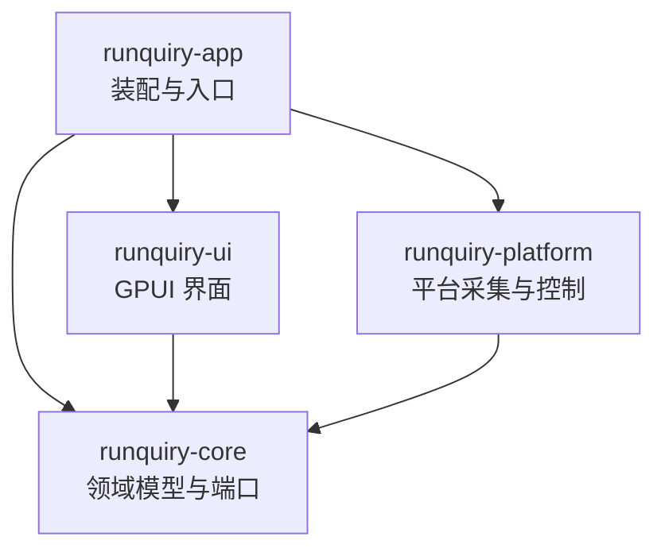

# Runquiry

对本地 [witr](witr/README.md)（Go CLI/TUI）的纯 Rust + GPUI 桌面化重写：原生桌面 GUI，提供 Processes、Ports、Containers、File Locks 四个工作区与按名称、PID、端口、文件、容器发起的调查。不嵌入 Go，不新增 CLI/TUI；运行期完全本地（无遥测、云服务、自动更新或后台网络请求）。目标平台 Linux、macOS、Windows，交付无签名安装包。

## 架构总览

Cargo workspace（resolver = "3"），四层单向依赖：



- **runquiry-core**：领域模型、目标解析、分析管线、告警规则、刷新状态机、平台端口（trait）。不依赖 GPUI 或操作系统。
- **runquiry-platform**：core 端口的三平台实现（采集器、容器运行时、进程控制、外部命令执行）。
- **runquiry-ui**：GPUI 状态、设计系统、四个工作区、调查面板、设置与国际化。
- **runquiry-app**：可执行装配层（窗口启动、配置持久化、资源与打包元数据）。

参考代码 [witr/](witr/README.md) 是行为契约的静态阅读来源，**不参与构建、不得修改、不入 Git**。

## 模块索引

| 模块 | 职责 | 文档 |
|---|---|---|
| crates/runquiry-core | 领域模型、目标解析、管线与平台端口 | [AGENTS.md](crates/runquiry-core/AGENTS.md) |
| crates/runquiry-platform | 平台采集器、容器运行时与进程控制 | [AGENTS.md](crates/runquiry-platform/AGENTS.md) |
| crates/runquiry-ui | GPUI 界面：工作区、调查面板与设计系统 | [AGENTS.md](crates/runquiry-ui/AGENTS.md) |
| crates/runquiry-app | 依赖装配、窗口启动与打包元数据 | [AGENTS.md](crates/runquiry-app/AGENTS.md) |
| docs/witr-parity.md | witr 行为契约（202 条，Runquiry 语义的唯一来源） | [witr-parity.md](docs/witr-parity.md) |
| .omo/plans/runquiry-gpui-desktop/ | 8 个模块的实施计划与任务勾选 | [总计划](.omo/plans/runquiry-gpui-desktop.md) |

## 运行与开发

```bash
cargo check -p runquiry-app --locked   # 编译检查（必须 --locked）
cargo run -p runquiry-app --locked     # 启动桌面窗口（当前为最小壳层）
cargo fmt --check                      # 格式检查
cargo deny check                       # 许可证/ advisories / 来源检查（需 cargo-deny）
```

- 工具链由 [rust-toolchain.toml](rust-toolchain.toml) 锁定 1.95.0（1.90–1.94 均实测编译失败，证据见模块 01 计划）。
- Linux 构建需系统依赖：pkg-config、libfontconfig1-dev、libfreetype-dev、libxkbcommon-dev、libxkbcommon-x11-dev、libwayland-dev、wayland-protocols、libx11-dev。
- WSLg 下 libEGL/MESA 软件渲染警告属正常。

## 依赖锁定（关键约束）

- gpui-component 固定 rev `91217366`，Zed GPUI 经 Cargo.lock 锁定 `f66ed399`；锁内 23 个 zed 包单一 source。
- **禁止无差别 `cargo update`**（GPUI 会漂移到 zed main 新提交）；所有验证、CI、打包必须 `--locked`。
- git 依赖在 runquiry-app 内联声明（cargo-deny 0.20 无法解析 git 源的 workspace 继承依赖），版本须与根 `Cargo.toml` 注释一致。
- 新增依赖由模块 01（A1）负责人集中修改并重新验证单一 GPUI source。

## 测试策略

- 测试尚未建立（骨架阶段）。计划：`cargo test -p runquiry-core --locked`、`cargo test -p runquiry-platform --locked`（A5 引入 fixture 与假平台后端后）。
- 行为语义以 [docs/witr-parity.md](docs/witr-parity.md) 为验收依据；fixture 要求合成值（无真实用户名、路径、Token）。

## 编码规范

- Rust edition 2024；rustfmt 由 [rustfmt.toml](rustfmt.toml) 约定（max_width = 100）。
- lint 基线在根 `Cargo.toml` `[workspace.lints]`：clippy all = deny、pedantic/nursery/cargo = warn；`unwrap_used`/`expect_used`/`panic`/`todo`/`unimplemented` 均 deny；`missing_docs` = warn。
- 依赖方向单向：core 不依赖 GPUI/OS；platform 与 ui 只依赖 core；ui 禁止直接读 /proc、调用 Win32 API 或运行 lsof/容器 CLI。
- 许可证：项目 GPL-3.0-or-later（[LICENSE](LICENSE)）；witr 归属见 [NOTICE](NOTICE)；deny.toml 中 GPL 例外仅限固定来源的 zlog/ztracing/ztracing_macro。

## AI 使用指引

- 任何功能实现前先读 [docs/witr-parity.md](docs/witr-parity.md) 对应章节——它逐项定义 parity / intentional change / out of scope，无需重新决定 witr 语义。
- 实施计划与任务勾选在 [.omo/plans/runquiry-gpui-desktop/](.omo/plans/runquiry-gpui-desktop/)；共享根文件（根 Cargo.toml、Cargo.lock、deny.toml、rust-toolchain.toml）只允许模块 01 负责人写入。
- 不修改 `witr/` 参考源码；不顺带升级计划外依赖。
- GPUI/gpui-component 用法参考 `.agents/skills/gpui/` 与 `.agents/skills/gpui-component/`（含 Root 契约：`Root` 必须是每个窗口的第一级视图）。

## 变更记录

- 2026-09-02 @9d4a616：A1 工程基线（四层 workspace、依赖锁定、最小窗口）、A2 witr 行为契约落地；初次建立 AI 上下文索引。

## 索引状态
- 上次索引：2026-09-02T10:25:19Z（@9d4a616）
- 基线提交：9d4a616d1822127e1bf1c01336bc8319a7905765
- 已知缺口：无
- 扫描进度：已完成