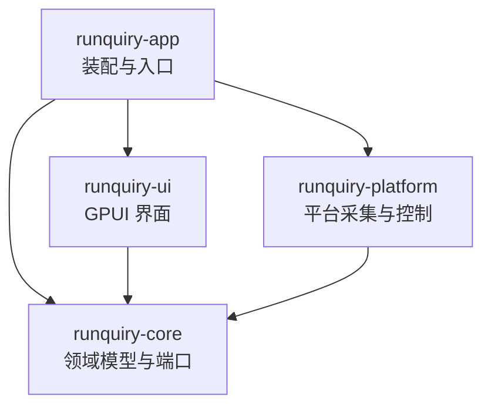

# Runquiry

对本地 [witr](witr/README.md)（Go CLI/TUI）的纯 Rust + GPUI 桌面化重写：原生桌面 GUI，提供 Processes、Ports、Containers、File Locks 四个工作区与按名称、PID、端口、文件、容器发起的调查。不嵌入 Go，不新增 CLI/TUI；运行期完全本地（无遥测、云服务、自动更新或后台网络请求）。v1 目标平台为 Linux 与 Windows，交付无签名安装包（macOS 与 FreeBSD 已明确移出范围）。

## 架构总览

Cargo workspace（resolver = "3"），四层单向依赖：



- **runquiry-core**：领域模型、目标解析、分析管线、告警规则、刷新状态机、平台端口（trait）。不依赖 GPUI 或操作系统。
- **runquiry-platform**：core 端口的 Linux/Windows 双平台实现（采集器、容器运行时、进程控制与文件定位、外部命令执行）；非这两个目标由 `compile_error!` 显式拒绝。
- **runquiry-ui**：GPUI 状态、设计系统、四个工作区、调查面板、设置与国际化。
- **runquiry-app**：可执行装配层（窗口启动、配置持久化、资源与打包元数据）。

参考代码 [witr/](witr/README.md) 是行为契约的静态阅读来源，**不参与构建、不得修改、不入 Git**。

## 模块索引

| 模块 | 职责 | 文档 |
|---|---|---|
| crates/runquiry-core | 领域模型、目标解析、管线与平台端口 | [AGENTS.md](crates/runquiry-core/AGENTS.md) |
| crates/runquiry-platform | 平台采集器、容器运行时、进程控制与文件定位 | [AGENTS.md](crates/runquiry-platform/AGENTS.md) |
| crates/runquiry-ui | GPUI 界面：工作区、调查面板与设计系统 | [AGENTS.md](crates/runquiry-ui/AGENTS.md) |
| crates/runquiry-app | 依赖装配、窗口启动与打包元数据 | [AGENTS.md](crates/runquiry-app/AGENTS.md) |
| docs/witr-parity.md | witr 行为契约（205 条 / 12 节，Runquiry 语义的唯一来源） | [witr-parity.md](docs/witr-parity.md) |
| Packager.toml、about.toml、about.hbs、packaging/、scripts/ | 无签名安装包配置、第三方许可证清单与 Windows 打包 runner | [模块 08 计划](.omo/plans/runquiry-gpui-desktop/08-integration-release.md) |
| .omo/plans/runquiry-gpui-desktop/ | 7 个模块的实施计划与任务勾选 | [总计划](.omo/plans/runquiry-gpui-desktop.md) |

## 运行与开发

```bash
cargo check -p runquiry-app --locked   # 编译检查（必须 --locked）
cargo run -p runquiry-app --locked     # 启动产品壳层与本地采集后端
cargo fmt --check                      # 格式检查
cargo deny check                       # 许可证 / advisories / 来源检查（需 cargo-deny）
```

- 组件实验台：`cargo run -p runquiry-app --example gallery --locked`；真实采集与控制 QA 示例见 platform 模块文档。
- 平台 QA 与桌面 QA 示例（`linux_qa`、`container_qa`、`process_controller_qa`、`windows_qa`、`scale_qa`）均为只读或无副作用场景，只操作自建进程。
- 打包（当前仅 Windows 已验证）：`scripts/package-windows.sh` 依次执行 `cargo about generate`、`--locked` release 构建、MSI（cargo-packager）、便携版 zip 与 `dist/SHA256SUMS`，并断言 `Cargo.lock` 未漂移；产物写入 `dist/`（已 gitignore）。配置为根 `Packager.toml`（wix/deb/appimage 三格式，全部无签名、无密钥），第三方许可证清单由 `about.toml` + `about.hbs` 生成到 `docs/third-party-licenses.md`。
- 二进制元数据：`runquiry --version` / `runquiry --help` 由 `src/main.rs` 用标准库实现，未知参数退出码 2。
- 工具链由 [rust-toolchain.toml](rust-toolchain.toml) 锁定 1.95.0（1.90–1.94 均实测编译失败，证据见模块 01 计划）；环境变量 `RUSTUP_TOOLCHAIN` 会静默覆盖该锁定，验证前先确认实际版本。
- Linux 构建需系统依赖：pkg-config、libfontconfig1-dev、libfreetype-dev、libxkbcommon-dev、libxkbcommon-x11-dev、libwayland-dev、wayland-protocols、libx11-dev。
- WSLg 下 libEGL/MESA 软件渲染警告属正常。
- 环境与验证的仓库特有教训（工具链覆盖、WSLg 强制 X11、GUI QA 不做键鼠注入、ETXTBSY flaky 判定口径）记录在 [tasks/lessons.md](tasks/lessons.md)。

## 依赖锁定（关键约束）

- GPUI Kit 在根 `Cargo.toml` 的 workspace dependencies 中精确锁定为 `=0.6.1`，runquiry-app 与 runquiry-ui 统一继承；GPUI、组件与资源分别由 `gpui_kit`、`gpui_kit::component`、`gpui_kit::assets` 提供。
- 配套 `gpui-pre-*` 家族由 `Cargo.lock` 锁定（0.3.4 系列；`gpui-pre-reqwest` 走自身 0.12 版本线），依赖来源统一为 crates.io；不得混入旧 GPUI/git 组件依赖。
- **禁止无差别 `cargo update`**；所有验证、CI、打包必须 `--locked`。
- 新增依赖由模块 01（A1）负责人集中修改并重新验证 GPUI 类型与来源一致性。

## 测试策略

- 运行方式：`cargo test --workspace --all-targets --locked`；按 crate 用 `-p`，超长套件可按测试目标定向执行。两平台测试矩阵不同——Linux 多出 `cfg(unix)` 门控套件（命令执行、容器 CLI）与 `#[cfg(target_os = "linux")]` 采集/控制测试，Windows 运行 `windows_*` 纯解析套件、Windows 内联测试与真机活测试，需在各自环境分别验证。
- 测试数量（本轮静态 `#[test]` 计数）：core 113、ui 93、app 32（另有 `examples/scale_qa` 3）；platform 按测试目标分布，详见各模块文档。静态计数不等于运行结果，历史运行数字与证据见模块文档与 `.omo/evidence/`。
- 约束：禁止给 runquiry-ui 添加 gpui test-support dev-dependency（新增测试依赖须经依赖守门人核验），纯逻辑一律普通 `#[test]`；`unwrap_used`/`expect_used` 对测试代码同样 deny（无 clippy.toml 豁免），测试用 `Result + ?` / `unwrap_or` / `assert!`。
- 合成 fixture 与失败注入在 workspace 根 `tests/fixtures/`（`linux`/`windows` 各一套，清单与敏感信息扫描见其 README.md）；SocketEntry 输入边界规则（TCP/UDP 必有合法端口、Unix 必无端口）在 fixture loader 层执行，平台真实输入必须复用。
- 行为语义以 [docs/witr-parity.md](docs/witr-parity.md) 为验收依据；fixture 要求合成值（无真实用户名、路径、Token）。

## 编码规范

- Rust edition 2024；rustfmt 由 [rustfmt.toml](rustfmt.toml) 约定（max_width = 100）。
- lint 基线在根 `Cargo.toml` `[workspace.lints]`：clippy all = deny、pedantic/nursery/cargo = warn；`unwrap_used`/`expect_used`/`panic`/`todo`/`unimplemented`/`dbg_macro` 均 deny；FFI 相关 `undocumented_unsafe_blocks`（安全注释须用 ASCII 冒号 `// SAFETY:`）与 `multiple_unsafe_ops_per_block` 同样 deny；`missing_docs` = warn。
- 依赖方向单向：core 不依赖 GPUI/OS；platform 与 ui 只依赖 core；ui 禁止直接读 /proc、调用 Win32 API 或运行 lsof/容器 CLI。
- 许可证：项目 GPL-3.0-or-later（[LICENSE](LICENSE)）；witr 归属见 [NOTICE](NOTICE)；依赖许可证与来源限制以 `deny.toml` 为准（`allow-git = []`，依赖全部来自 crates.io）。

## AI 使用指引

- 任何功能实现前先读 [docs/witr-parity.md](docs/witr-parity.md) 对应章节——它逐项定义 parity / intentional change / out of scope，无需重新决定 witr 语义。
- 实施计划与任务勾选在 [.omo/plans/runquiry-gpui-desktop/](.omo/plans/runquiry-gpui-desktop/)；验收证据、QA 记录与根因分析在 `.omo/evidence/`（未入 Git）。共享根文件（根 Cargo.toml、Cargo.lock、deny.toml、rust-toolchain.toml）只允许模块 01 负责人写入。
- 不修改 `witr/` 参考源码；不顺带升级计划外依赖。
- GPUI Kit API 与框架机制参考 `.agents/skills/gpui-kit/`；设计与交互变更先读 `.agents/skills/gpui-kit-design-guides/`。`gpui_kit::component::Root` 必须是每个窗口的第一级视图。

## 索引状态
- 上次索引：2026-09-13T05:13:18Z
- 基线提交：1edb685149a9c7d008f5c2d72c071a4d8214e2b7
- 已知缺口：各模块测试数量为静态 `#[test]` 计数而非本轮运行结果（运行历史与证据见模块文档、`.omo/evidence/`）；单文件「纯代码 ≤250 行」红线未逐文件折算核实；`docs/third-party-licenses.md` 生成物只记录路径未统计条目数。
- 扫描进度：已完成
