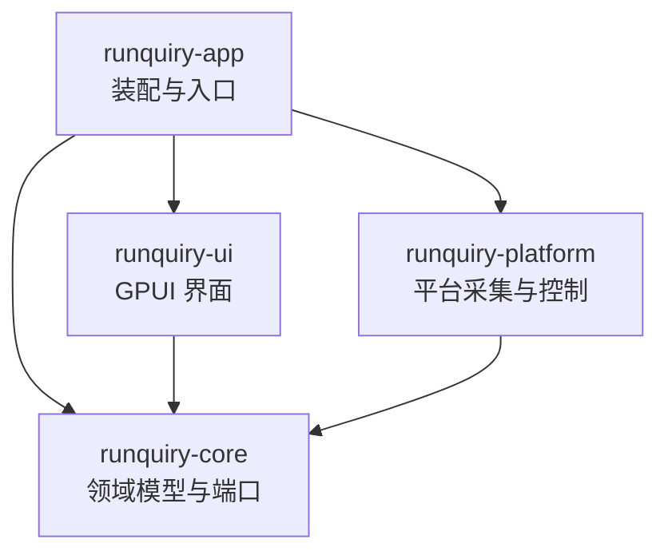

# Runquiry

对本地 [witr](witr/README.md)（Go CLI/TUI）的纯 Rust + GPUI 桌面化重写：原生桌面 GUI，提供 Processes、Ports、Containers、File Locks 四个工作区与按名称、PID、端口、文件、容器发起的调查。不嵌入 Go，不新增 CLI/TUI；运行期完全本地（无遥测、云服务、自动更新或后台网络请求）。目标平台 Linux、macOS、Windows，交付无签名安装包。

## 架构总览

Cargo workspace（resolver = "3"），四层单向依赖：



- **runquiry-core**：领域模型、目标解析、分析管线、告警规则、刷新状态机、平台端口（trait）。不依赖 GPUI 或操作系统。
- **runquiry-platform**：core 端口的三平台实现（采集器、容器运行时、进程控制、外部命令执行）。
- **runquiry-ui**：GPUI 状态、设计系统、四个工作区、调查面板、设置与国际化。
- **runquiry-app**：可执行装配层（窗口启动、配置持久化、资源与打包元数据）。

参考代码 [witr/](witr/README.md) 是行为契约的静态阅读来源，**不参与构建、不得修改、不入 Git**。

## 模块索引

| 模块 | 职责 | 文档 |
|---|---|---|
| crates/runquiry-core | 领域模型、目标解析、管线与平台端口 | [AGENTS.md](crates/runquiry-core/AGENTS.md) |
| crates/runquiry-platform | 平台采集器、容器运行时与进程控制 | [AGENTS.md](crates/runquiry-platform/AGENTS.md) |
| crates/runquiry-ui | GPUI 界面：工作区、调查面板与设计系统 | [AGENTS.md](crates/runquiry-ui/AGENTS.md) |
| crates/runquiry-app | 依赖装配、窗口启动与打包元数据 | [AGENTS.md](crates/runquiry-app/AGENTS.md) |
| docs/witr-parity.md | witr 行为契约（202 条，Runquiry 语义的唯一来源） | [witr-parity.md](docs/witr-parity.md) |
| .omo/plans/runquiry-gpui-desktop/ | 8 个模块的实施计划与任务勾选 | [总计划](.omo/plans/runquiry-gpui-desktop.md) |

## 运行与开发

```bash
cargo check -p runquiry-app --locked   # 编译检查（必须 --locked）
cargo run -p runquiry-app --locked     # 启动产品壳层与本地采集后端
cargo fmt --check                      # 格式检查
cargo deny check                       # 许可证/ advisories / 来源检查（需 cargo-deny）
```

- 工具链由 [rust-toolchain.toml](rust-toolchain.toml) 锁定 1.95.0（1.90–1.94 均实测编译失败，证据见模块 01 计划）。
- Linux 构建需系统依赖：pkg-config、libfontconfig1-dev、libfreetype-dev、libxkbcommon-dev、libxkbcommon-x11-dev、libwayland-dev、wayland-protocols、libx11-dev。
- WSLg 下 libEGL/MESA 软件渲染警告属正常。

## 依赖锁定（关键约束）

- gpui-component 固定 rev `91217366`，Zed GPUI 经 Cargo.lock 锁定 `f66ed399`；锁内 23 个 zed 包单一 source。
- **禁止无差别 `cargo update`**（GPUI 会漂移到 zed main 新提交）；所有验证、CI、打包必须 `--locked`。
- git 依赖在 runquiry-app 与 runquiry-ui 内联声明（cargo-deny 0.20 无法解析 git 源的 workspace 继承依赖），两处 version/rev 须保持一致并与根 `Cargo.toml` 注释同步。
- 新增依赖由模块 01（A1）负责人集中修改并重新验证单一 GPUI source。

## 测试策略

- Batch 6 前基线为四 crate 273 个测试：`cargo test -p runquiry-core --locked`（107）、`-p runquiry-platform`（97）、`-p runquiry-ui`（48）、`-p runquiry-app`（21）；B7 独立结果为 platform `process_controller` 6/6、UI 完整套件 57/57，随后确认态定向测试 1/1，app 24/24；这些调用不可相加推断为本轮全量测试或“58 个 UI 全跑”。`cargo test -p runquiry-ui` 等禁止给 ui 加 gpui test-support dev-dependency（会引入 deny 白名单外 git 源 proptest），纯逻辑一律普通 `#[test]`。Batch 6 当前实测：core 110/110（+3 个 launchd/Windows service/init 来源判定测试）、app 24/24；platform 新增 `tests/macos_*` / `tests/windows_*` 纯解析套件（约 30+ 测试，经 `#[path]` 引入 src 纯模块）**尚未运行**（本机 WSL 构建卡死停跑，见 `.omo/evidence/batch6-result.md`）。Batch 7A C3 新增：UI `capability_contract_tests` 7 个三平台假后端契约测试 + `from_parts` 状态推导断言测试、app `failed_collection_error` 映射测试，**全部已编写、未运行**（延续构建禁令，见 `.omo/evidence/batch7a-result.md`），运行后以实际数字更新各模块 AGENTS。
- 合成 fixture 与失败注入在 workspace 根 `tests/fixtures/`（清单与敏感信息扫描见其 README.md）；SocketEntry 输入边界规则（TCP/UDP 必有合法端口、Unix 必无端口）在 fixture loader 层执行，平台真实输入必须复用。
- 行为语义以 [docs/witr-parity.md](docs/witr-parity.md) 为验收依据；fixture 要求合成值（无真实用户名、路径、Token）。

## 编码规范

- Rust edition 2024；rustfmt 由 [rustfmt.toml](rustfmt.toml) 约定（max_width = 100）。
- lint 基线在根 `Cargo.toml` `[workspace.lints]`：clippy all = deny、pedantic/nursery/cargo = warn；`unwrap_used`/`expect_used`/`panic`/`todo`/`unimplemented` 均 deny；`missing_docs` = warn。
- 依赖方向单向：core 不依赖 GPUI/OS；platform 与 ui 只依赖 core；ui 禁止直接读 /proc、调用 Win32 API 或运行 lsof/容器 CLI。
- 许可证：项目 GPL-3.0-or-later（[LICENSE](LICENSE)）；witr 归属见 [NOTICE](NOTICE)；deny.toml 中 GPL 例外仅限固定来源的 zlog/ztracing/ztracing_macro。

## AI 使用指引

- 任何功能实现前先读 [docs/witr-parity.md](docs/witr-parity.md) 对应章节——它逐项定义 parity / intentional change / out of scope，无需重新决定 witr 语义。
- 实施计划与任务勾选在 [.omo/plans/runquiry-gpui-desktop/](.omo/plans/runquiry-gpui-desktop/)；共享根文件（根 Cargo.toml、Cargo.lock、deny.toml、rust-toolchain.toml）只允许模块 01 负责人写入。
- 不修改 `witr/` 参考源码；不顺带升级计划外依赖。
- GPUI/gpui-component 用法参考 `.agents/skills/gpui/` 与 `.agents/skills/gpui-component/`（含 Root 契约：`Root` 必须是每个窗口的第一级视图）。

## 变更记录

- 2026-09-02 @9d4a616：A1 工程基线（四层 workspace、依赖锁定、最小窗口）、A2 witr 行为契约落地；初次建立 AI 上下文索引。
- 2026-09-03（未提交工作区）：Batch 1——A3 核心领域类型与七平台端口落地（serde 经守门人批准，零新增包）；A4 设计系统（DESIGN.md + runquiry-ui 主题/状态/双语占位）与独立 gallery 实验台（runquiry-app/examples/gallery）；gpui/gpui-component git 依赖同步内联至 runquiry-ui。
- 2026-09-03（未提交工作区）：Batch 2——Phase 0 修复 gallery Name 列省略/tooltip/Sheet 绑定行并复验（qa-report §10）；A5 三平台 fixture + 失败注入 + ProcessController 契约修正（tests/fixtures/）；B4 产品壳层（runquiry-app 装配 + runquiry-ui shell/session/debounce）+ core 纯刷新策略 + 设置持久化 allowlist + rust-i18n 迁移（runquiry-ui/locales，新增 rust-i18n/serde/serde_json 依赖均为 lock 内既有版本，零新增包）。
- 2026-09-03（未提交工作区）：Batch 2 评审修复——core 刷新完成/中止绑定 generation（过期信号不释放新请求）；UI 落实 1099/1100px 响应式断点并使用 Unsupported 能力边界态；app 以真实 bounds 事件持久化窗口尺寸，设置写入改为绝对安全路径、唯一排他临时文件与 Unix 私有权限；补齐 Gallery 第二行 → Sheet 及四工作区宽/窄窗视觉证据；测试增至 82 个。
- 2026-09-04 @984999c：Batch 3——B1 目标解析与分析管线；B2 Linux 只读适配器；B3 受限 CommandRunner 与七容器运行时；新增直接依赖 sysinfo/serde/serde_json/zbus/libc（全部锁内既有包，GPUI source 未漂移）。首轮评审已修复 analyze 单快照、祖先链诊断、健康标签、收养后代排除、ProcessFileLocks 与 ContainerHealthcheckProbe。当时未做 B5/B6/B7/B8、macOS/Windows、打包；B5/B6 已在下条 Batch 4A 落地。
- 2026-09-04（未提交工作区）：Batch 3 阻断项修复——命令输出超限/取消/读取失败均类型化失败并回收进程组，修复双流竞态；sudo 下 Podman/nerdctl 恢复原用户；容器 command/Compose 五字段仅留私有临时结构，nerdctl 稳定键改为 containerd，补 Docker 发布端口回退；host PID 经 Linux cgroup 二次验证；生产 PID 枚举回归 sysinfo，详情字段失败保留部分结果，构造墙钟生效，systemd D-Bus 加方法超时与 single-flight；超长 core/platform 测试拆分。测试增至 232 个，本轮改动的 core/platform 文件均低于 250 纯代码行。
- 2026-09-04（未提交工作区）：Batch 4A——P1 将 `FileInventory` 扩展为可见打开文件与真实锁的列表/路径持有者契约，Linux 以 `/proc/PID/fd` 与 `/proc/locks` 采集并保留有界诊断；B5 完成进程列表、筛选/排序、五类查询、分析详情与操作入口的安全禁用态；B6 完成 Ports、Containers、File Locks 的真实快照、表格与详情。I1 在 app 边界装配本地平台后端：每次 load/resolve/analyze 新建 `LinuxPlatform`，共享 `AnalysisGate` 保留跨请求分析互斥；宽窗使用真实 `h_resizable` 详情分栏，窄窗改用 Sheet；语言切换同步既有 `InputState` 占位符。测试基线为 core 107、platform 97、ui 48、app 21。
- 2026-09-07（未提交工作区）：Batch 4B B7——Linux 进程控制以 pidfd 绑定 TERM/KILL/STOP/CONT，renice 明确保留 PID 复用 TOCTOU；UI/App 接入能力态、二次确认、键盘与异步刷新桥接。真实 X11 QA 已完成五类动作、非法输入、权限边界、输入焦点及 Sheet/Dialog 分层与 Escape 验收；B8 尚未开始，不据此宣称全平台验收。

- 2026-09-07 @0c476b5（Batch 5）：B8 Linux X11/Wayland 真实验收通过，独立门禁 CONFIRMED（见 .omo/evidence/batch5-*），C1/C2 前置门解除。
- 2026-09-07（未提交工作区）：Batch 6 C1/C2——macOS（`src/macos/`，libproc 手写绑定 + lsof -F + launchctl/plist + kill(2)/setpriority 控制）与 Windows（`src/windows/`，windows-sys 0.61.2 安全包装 + IP Helper + PEB/PEB32 有界读取 + SCM 证据，File Locks 与进程控制 Unsupported）适配器代码落盘；core `SourceEvidence` 加性扩展 launchd/Windows service 证据并补齐来源判定链（core 110 测试全绿）；app backend 按 target_os 装配平台别名（Linux 24/24 回归通过）；依赖守门新增 windows-sys 0.61.2（锁内既有版本，Cargo.lock 仅 +1 行依赖边，GPUI source 未漂移）。**所有 macOS/Windows cfg 代码未编译、未测试**（WSL 编译链接两次卡死，用户叫停后续构建），C1/C2 保持未完成状态，实机验收未开始；独立 FFI 审查发现并修复 2 处阻断 + 3 处建议缺陷；随后静态 code-review（双轴）修复 app `ContainerRuntimes` cfg 导入错误、25 处测试 unwrap 基线违规、IP Helper 重试丢尺寸、Windows start_time 0 语义，并接线 parity line 88 的 macOS launchd 名称解析回退。

- 2026-09-07（未提交工作区）：Batch 7A C3（能力矩阵与条件 UI，验证阻断）——`DataState` 新增 `Unavailable` 环境边界态（DESIGN §6 六种呈现状态、图标 `info`，gallery CLI/文案同步）；产品工作区状态文案统一走 `locale::workspace_state_copy`，删除死键 `main.collector_unavailable.*`；`LoadPresentation::boundary_reason` 保留 Unsupported/Unavailable 平台原因并在 StateView 透出（Windows File Locks 保留导航入口并解释原因），能力边界下模式/筛选/排序按钮禁用；进程控制能力随 Processes 刷新在后台动态取回，能力退化经 `ProcessActionFlow::revoke_confirmation_if_unusable` 撤销确认、提交前再门禁；动作错误补 `actions.error.unsupported`/`actions.error.external_tool` 键。app 边界：`process_control_capability` 平台构造失败改 `CapabilityStatus::Unavailable`，resolve 端口/文件采集失败经 `failed_collection_error` 保留平台诊断。新增 UI 7 个三平台假后端契约测试（复用生产状态转换，纯 `#[test]`）与 app 1 个映射测试，**全部已编写、未运行**（延续构建禁令），C3 保持未勾选，不解除 C1/C2 前置验收要求；不改 core/platform/Cargo.lock/依赖。code-review（双轴）修复：Processes 页失败采集不再伪装成空集合（新增 `SurfaceState::from_parts` 与清单 `map_state` 同语义，`state_from_inspection` 改部件签名为单一事实源），Processes 交互门控与边界判定同源；平台原因本地化维持「UI 双语 + 原因原样附显」折中（修复属 core/platform 范围）。
- 2026-09-07（未提交工作区）：Batch 7B C4（套件准备，验证阻断）——三平台契约覆盖矩阵、静态差异复核与缺口清单落地（`.omo/evidence/batch7b-c4-matrix.md`，静态盘点 core 111 / platform 188 / ui 69 / app 28 个测试（ui 含本轮 2 个新门禁测试），最后全绿基线 core 110、platform 97、ui 57、app 24）；提交前再门禁提取为 `ProcessActionFlow::confirm_if_usable` 并补 2 个门禁测试（闭合 H 类确认门禁断言缺口）。差异分类：Unavailable 跨路径表达不一致为已记录低危实现缺陷（根因 core 无 Unavailable 错误变体）、平台原因不本地化为计划明示折中（全部中文硬编码产生点已定位）、能力退化撤销与提交门禁传播完整无绕过。环境盘点：无 macOS 主机；WSL 后发现 Windows 主机（rustup 1.98.0-msvc）待授权；交叉目标装在 1.98.0 与锁定 1.95.0 不一致。C1/C2 编译与实机证据仍为零，C4 保持未完成、v1 契约未冻结、不开始 D1/D2；本轮零依赖改动、零 Cargo.lock 改动。

## 索引状态
- 上次索引：2026-09-07（Batch 7B C4 套件准备，未提交工作区，主 Agent 直接增量更新）
- 基线提交：6713aa0（Batch 7A C3 提交）
- 已知缺口：C1/C2 代码未编译未测试、macOS/Windows 实机验收未开始；Batch 7B C4 仅有覆盖矩阵与套件准备，三平台验证未执行、v1 契约未冻结（延续 WSL 构建禁令，无 macOS 环境）；B8 已通过（.omo/evidence/batch5-*），不重复验收
- 扫描进度：已完成
